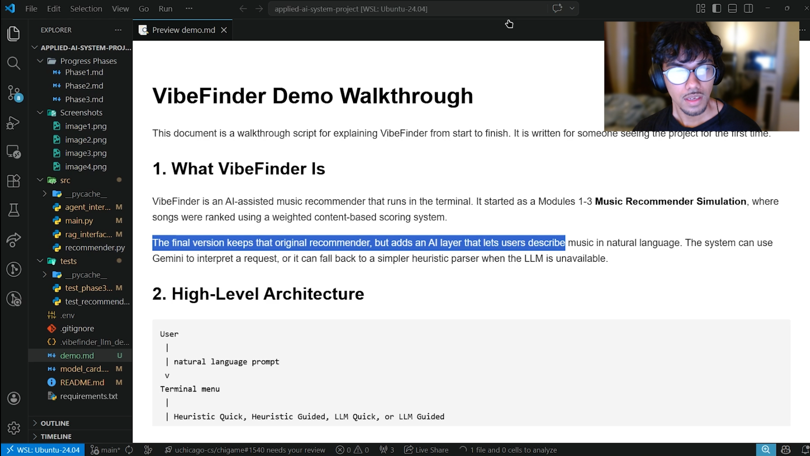

# VibeFinder: AI-Assisted Music Recommender

## Title And Summary

VibeFinder is a terminal-based music recommender that turns a natural language request into ranked song recommendations. It matters because it shows how an AI system can combine an LLM with a transparent scoring model, so the user can see not only the final songs but also why those songs were chosen.

The original project from Modules 1-3 was a **Music Recommender Simulation**. Its goal was to recommend songs from a small CSV catalog by comparing a user's preferences against song features like genre, mood, energy, tempo, valence, danceability, and acousticness. The original version used a weighted content-based scoring system; this final version keeps that recommender as the core and adds an LLM-powered terminal interface on top of it.

## Architecture Overview

VibeFinder uses one shared recommendation workflow with two interaction styles and two parsing modes:

- `Quick Recommend`: the user enters one request and gets recommendations immediately.
- `Guided Agent`: the user can refine the results across multiple turns.
- `Heuristic`: uses the local keyword parser only.
- `LLM`: uses Gemini first, with fallback behavior if the model call fails.

All four menu choices use the same backend. The guided mode is more iterative, but it reuses the same intent extraction, retrieval, and ranking steps as quick mode.

```text
User prompt
   |
   v
Terminal menu in src/main.py
   |
   v
src/agent_interface.py
   |
   v
src/rag_interface.py
   - Uses Gemini when available
   - Falls back to heuristic parsing when needed
   - Converts natural language into structured intent
   - Retrieves likely candidates from data/songs.csv
   |
   v
src/recommender.py
   - Scores songs with weighted feature matching
   - Returns ranked recommendations and explanations
```

The LLM does not directly choose the final songs. Instead, it converts the user's request into structured fields such as `genre`, `mood`, `energy`, and `valence`. The existing recommender then scores songs using those fields. This makes the system easier to debug because the output shows the LLM JSON, the parsed scoring inputs, and the final ranking reasons.

## Setup Instructions

1. Create and activate a virtual environment:

```bash
python -m venv .venv
source .venv/bin/activate
```

2. Install dependencies:

```bash
pip install -r requirements.txt
```

3. Add a Gemini API key in a local `.env` file:

```bash
GEMINI_API_KEY=your_api_key_here
```

You can also use `GOOGLE_API_KEY` instead. The app still works without an API key, but it will use the heuristic fallback instead of the LLM.

4. Run the app:

```bash
python -m src.main
```

5. Run tests:

```bash
pytest
```

## Sample Interactions

### Example 1: Guided Agent With LLM

Input:

```text
Looking for poppy upbeat and happy songs
```

Observed AI interpretation:

```json
{
  "genre": "pop",
  "mood": "happy",
  "energy": 0.8,
  "valence": 0.9,
  "prefer_chill": false,
  "prefer_acoustic": false,
  "confidence": 0.9
}
```

Result:

```text
1. Sunrise City - Neon Echo
   Final Score: 0.993
   Reasons:
   - Genre match: +0.25 points
   - Mood match: +0.20 points
   - Energy closeness (target 0.80, song 0.82): +0.20 points
   - Acousticness closeness (target 0.20, song 0.18): +0.15 points
   - Valence closeness (target 0.90, song 0.84): +0.03 points
```

Screenshots from this successful run:

- [Intent diagnostics](Screenshots/image3.png)
- [Ranked recommendations](Screenshots/image4.png)

### Demo Video

[](https://drive.google.com/file/d/1l60vakdngig98dCFil-BtqGAEky7xX71/view?usp=sharing)

Click the thumbnail above to watch the project walkthrough video.

### Example 2: Quick Recommend With Fallback

Input:

```text
I want a spacey calm vibey song
```

During testing, Gemini returned malformed JSON, so VibeFinder safely fell back to the heuristic parser. The system still returned recommendations instead of crashing. The top result was:

```text
1. Spacewalk Thoughts - Orbit Bloom
   Final Score: 0.242
```

This test helped reveal why structured LLM output matters. After this, I increased the Gemini output budget, disabled thinking for JSON extraction, added response schemas, and added intent diagnostics so the user can see whether the result came from `LLM` or `HEURISTIC`.

### Example 3: Heuristic Mode Without API Key

If no API key is available, the system still works:

```text
Note
- Gemini intent parsing unavailable: no API key configured.

Intent diagnostics
Source: HEURISTIC
Parsed scoring inputs:
- genre: lofi
- energy: 0.25
- acousticness: 0.7
- likes_acoustic: True
```

This fallback matters because the app remains usable even when the external LLM is unavailable, rate-limited, or returns bad output.

## Design Decisions

I built VibeFinder as a two-part system that relies on the same workflow. The quick mode is for users who want an immediate answer. The guided mode is more iterative and reflective, but it still reuses the same core steps: understand the request, retrieve likely candidates, rank songs, and explain the results.

The inspiration for this design came from what I thought users would actually find useful. Sometimes a user only wants a fast recommendation. Other times, they may want to explore and adjust the recommendation, especially if the first result is close but not quite right. Instead of building two separate systems, I kept one shared backend and gave it two interaction styles.

A major design trade-off was keeping the recommender transparent instead of letting the LLM directly pick songs. The LLM is good at understanding vague language like "poppy upbeat and happy," but it can also be unpredictable. By forcing the LLM to produce structured JSON and then passing that JSON into the existing scoring model, the system becomes easier to inspect and debug.

Another trade-off is that the catalog is small, so a complicated retrieval system would be unnecessary. I used lightweight RAG-style retrieval over the CSV catalog: the system first selects likely candidates using simple similarity signals, then the shared recommender ranks those candidates with weighted scoring.

## How Scoring Works

Each song has features from `data/songs.csv`, including:

- `genre`
- `mood`
- `energy`
- `tempo_bpm`
- `valence`
- `danceability`
- `acousticness`

The ranking weights are:

- `genre = 0.25`
- `mood = 0.20`
- `energy = 0.20`
- `acousticness = 0.15`
- `tempo_bpm = 0.10`
- `danceability = 0.07`
- `valence = 0.03`

For genre and mood, the score is based on whether the song matches the user's target. For numeric fields like energy or valence, the score rewards songs that are close to the target instead of simply being higher or lower. The final score is a weighted combination of these feature scores.

## Testing Summary

The project was tested in three ways:

- Unit tests check the core recommender, Phase 3 intent parsing, retrieval, fallback behavior, and guided-agent state changes.
- Manual terminal tests check whether the app feels usable from the user's point of view.
- LLM diagnostics check whether Gemini output maps cleanly into the scoring inputs.

What worked:

- The shared ranking engine stayed stable while adding the LLM interface.
- The fallback path worked when Gemini was unavailable or returned invalid JSON.
- The new diagnostics made it clear whether a result came from the LLM or heuristic fallback.
- The guided mode successfully used LLM output to produce explainable recommendations.

What did not work at first:

- The LLM output was initially too unstructured, which made it hard to map into the existing recommender.
- Gemini once returned truncated JSON, causing parsing to fail.
- The app originally did not clearly tell the user whether the LLM or heuristic path produced the recommendation.

What I learned from testing:

- LLM output needs to be treated as untrusted input.
- Structured input and output make AI systems much easier to debug.
- A fallback path is important because external model calls can fail for reasons outside the app's control.
- Explainability is not just a nice feature; it is what made the system possible to improve.

## Reflection

This project taught me that adding AI to an existing system is not just about calling an LLM. The harder part is deciding what role the LLM should play. In VibeFinder, the LLM is useful for translating natural language into structured preferences, but the final ranking is still handled by a transparent recommender. That separation made the system easier to reason about.

I also learned how important it is to sanitize both inputs and expected outputs from an LLM. At first, there was not enough structure around the LLM response, so it was unclear how the model's interpretation connected to the final recommendations. Once I added structured JSON, validation, fallback behavior, and diagnostics, I could follow the chain of reasoning from the user's words to the parsed intent to the ranking score.

The biggest problem-solving lesson was that AI bugs can look mysterious until the system exposes its intermediate steps. Seeing the raw JSON, parsed fields, and scoring weights made the behavior much less obscure. It helped me understand that good AI systems need guardrails, not just intelligence.

### Limitations And Biases

VibeFinder is limited by the simplicity of its ranking system. It uses a weighted scoring model with Gaussian closeness for numeric fields, so the quality of recommendations depends heavily on the chosen weights and sigma thresholds. If those thresholds are too strict or too loose, the system may over-reward or under-reward certain song features.

The dataset is also small, so the recommender can only suggest songs that already exist in `data/songs.csv`. This can create bias toward the genres, moods, and artists represented in that file. The LLM layer also has limits: it uses a free Gemini model, can hit rate limits, and may misunderstand vague prompts. Guided mode is helpful, but its clarifying questions are still based on predefined categories, so it cannot ask every possible follow-up question a human might ask.

### Misuse And Prevention

This AI could be misused by sending irrelevant, abusive, or excessive prompts. I cannot fully control what a user types, so the system has to assume that input may be unrelated to music or poorly formed.

To reduce risk, I added guardrails around the LLM calls: per-session call limits, cooldowns between calls, caching for repeated prompts, provider backoff after rate limits, and fallback behavior when the LLM fails. The system also avoids exposing the API key and only logs sanitized debug information. Since this is a classroom music recommender, the main misuse risk is API abuse or over-trusting weak recommendations, not high-stakes harm.

### Reliability Testing Surprise

What surprised me most was that the system could seem broken even when the recommender itself was working. At first, I was confused by some outputs because I could not tell whether the LLM or heuristic fallback had produced the recommendation. Once I printed the source, raw JSON, parsed scoring inputs, ranking weights, and recommendation reasons, the behavior became much easier to understand.

I was also surprised by how much structure improved reliability. When the LLM output was unstructured, it was hard to map its answer into the existing scoring functions. After adding JSON schemas, validation, and diagnostics, the LLM became much easier to use in an iterative workflow. One unexpected issue was that Gemini returned truncated JSON until I adjusted the output budget and disabled thinking for the small extraction task.

### Collaboration With AI

I used AI as a debugging and planning partner during this project. One very helpful suggestion was to inspect the full LLM path instead of assuming the problem was only rate limiting. That helped identify several important issues: missing API keys could consume call budget, cooldown behavior was falling back too quickly, `429` errors needed clearer backoff handling, malformed JSON needed debug logging, and the terminal needed to show whether a result came from the LLM or heuristic fallback.

One flawed or incomplete suggestion happened earlier when the issue was framed mostly as a rate-limit problem. Rate limits were part of the concern, but the actual failure also involved JSON truncation and weak output structure. Some early guardrail ideas helped, but they did not fully solve the problem until the system added response schemas, better parsing, diagnostics, and safer fallback behavior. This taught me that AI suggestions are useful, but they still need to be tested against real program output.

## Future Improvements

- Improve the heuristic parser for vague words like "spacey," "vibey," and "dreamy."
- Add more songs and more diverse genres to make recommendations more interesting.
- Add artist diversity so the top results do not repeat the same artist too often.
- Save manual test results in a more formal evaluation log.
- Let users choose whether they want concise output or full diagnostic output.
